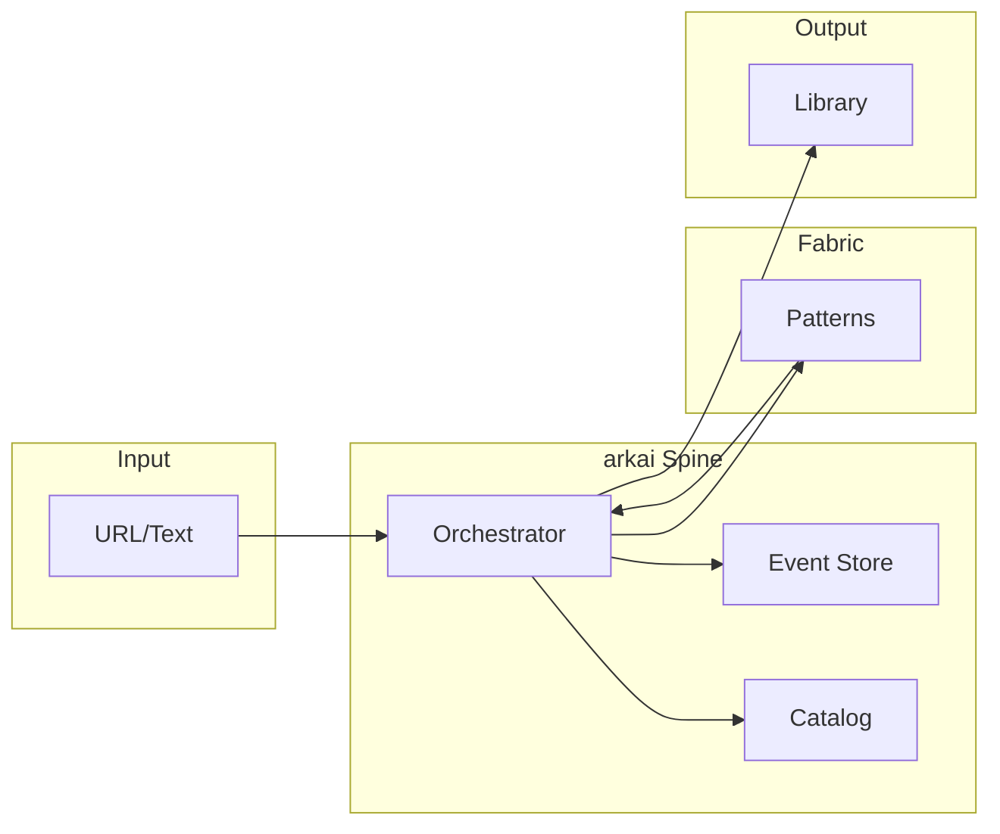
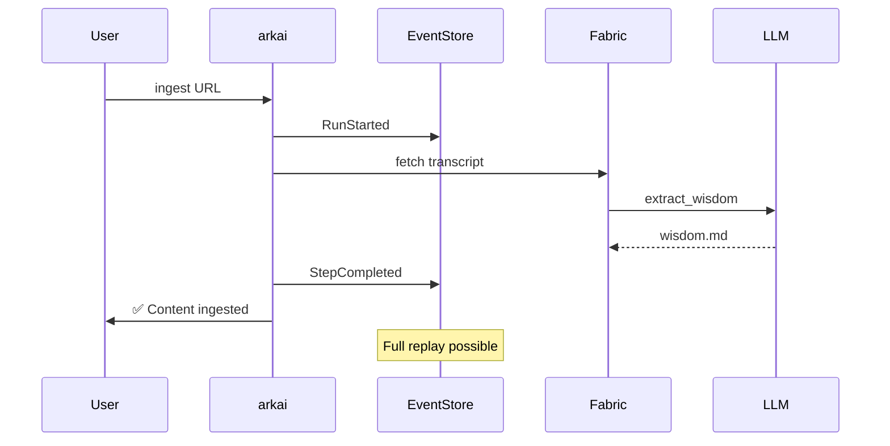

<!--
README BEAUTIFIER CHANGES:
- Added compelling tagline and hero section
- Added "Why arkai?" section with pain/solution framing
- Added ASCII architecture diagram
- Added comparison table vs alternatives
- Improved installation with prerequisites inline
- Added quickstart "60-second" section
- Added Mermaid diagrams (collapsible)
- Reorganized for scan-ability
- Added badges
- Kept all original functionality docs
-->

<div align="center">

# arkai

**The production backbone for AI pipelines.**

[](LICENSE)
[](https://www.rust-lang.org/)
[](https://github.com/danielmiessler/fabric)

*Event-sourced orchestration for [Fabric](https://github.com/danielmiessler/fabric) and beyond.*

[Quick Start](#-quick-start) • [Why arkai?](#-why-arkai) • [Features](#-features) • [Docs](docs/AI_OS_ARCHITECTURE.md)

</div>

---

## The Problem

Building AI workflows today means:
- **Results vanish** after each chat session
- **Pipelines fail** with no way to resume
- **No audit trail** of what happened or why
- **Spaghetti code** as complexity grows

## The Solution

arkai gives your AI a **spine** — a Rust-based orchestration layer that:
- **Remembers** everything (event-sourced state)
- **Recovers** from failures (idempotent resume)
- **Replays** any operation (full audit trail)
- **Scales** without spaghetti (YAML pipelines)

---

## 🚀 Quick Start

```bash
# Install arkai
cargo install --git https://github.com/arkaigrowth/arkai

# Install Fabric (AI pattern library)
go install github.com/danielmiessler/fabric@latest
fabric --setup

# Ingest your first video
arkai ingest "https://youtube.com/watch?v=..." --tags "ai,learning"

# Search your library
arkai search "transformers"
```

**That's it.** Your knowledge base grows with every ingest.

---

## 🤔 Why arkai?

| Without arkai | With arkai |
|--------------|------------|
| Results vanish after chat | Searchable library forever |
| Pipeline fails → start over | Resume from exact failure point |
| "What did the AI do?" 🤷 | Full event log, replay any step |
| Copy-paste prompt spaghetti | Composable YAML pipelines |

---

## 🏗️ Architecture

```
┌─────────────────────────────────────────────────────────────┐
│                    NATURAL LANGUAGE                          │
│              (Claude Code + /arkai skill)                    │
│                                                              │
│   "ingest this video" → arkai ingest "https://..."          │
└─────────────────────────────┬───────────────────────────────┘
                              │
┌─────────────────────────────▼───────────────────────────────┐
│                    RUST SPINE (arkai)                        │
│              Orchestration • State • Reliability             │
│                                                              │
│   ✓ Event-sourced    ✓ Idempotent    ✓ Auditable            │
└─────────────────────────────┬───────────────────────────────┘
                              │
┌─────────────────────────────▼───────────────────────────────┐
│                    FABRIC (patterns)                         │
│              AI Transformation • 200+ Prompts                │
└─────────────────────────────┬───────────────────────────────┘
                              │
┌─────────────────────────────▼───────────────────────────────┐
│                    LLM PROVIDER                              │
│         (Claude, GPT, Ollama, local models, etc.)           │
└─────────────────────────────────────────────────────────────┘
```

<details>
<summary><b>📊 Mermaid: Data Flow</b></summary>



</details>

<details>
<summary><b>📊 Mermaid: Event Sourcing</b></summary>



</details>

---

## ✨ Features

### Content Ingestion
```bash
# YouTube (auto-detected)
arkai ingest "https://youtube.com/watch?v=..." --tags "ai,ml"

# Web articles
arkai ingest "https://example.com/article" --tags "tech"
```

### Massive Context Analysis (RLM)
```bash
# Analyze entire repositories that exceed context windows
# Uses Recursive Language Model (MIT paper: arxiv.org/html/2512.24601v1)

# In Claude Code, RLM tools are available as MCP:
rlm_load_context      # Load files as external variables
rlm_filter_context    # Regex-based filtering (deterministic)
rlm_sub_query         # LLM call on chunks (budgeted)
rlm_exec             # Sandboxed Python execution (HITL)
```

### Searchable Library
```bash
arkai library                    # List all
arkai library --content-type youtube  # Filter
arkai search "transformer"       # Full-text search
arkai show <id> --full           # View content
```

### Pipeline Orchestration
```bash
arkai run my-pipeline            # Execute pipeline
arkai status <run_id>            # Check status
arkai resume <run_id>            # Resume failed run
```

### Debug & Observability
```bash
arkai config                     # Show resolved paths
arkai runs                       # List recent runs
```

---

## 📁 Project Structure

```
your-project/
├── .arkai/
│   ├── config.yaml        # Project config
│   ├── catalog.json       # Searchable index
│   └── runs/              # Event logs (gitignore)
│
├── library/               # Knowledge base (git-track!)
│   ├── youtube/
│   └── articles/
│
└── pipelines/             # Custom workflows
    └── my-workflow.yaml
```

---

## 📝 Pipeline Definition

```yaml
name: youtube-wisdom
description: Extract wisdom from YouTube videos

safety_limits:
  max_steps: 10
  step_timeout_seconds: 300

steps:
  - name: fetch
    action: __youtube__
    input_from: pipeline_input

  - name: wisdom
    action: extract_wisdom
    input_from: fetch

  - name: summary
    action: summarize
    input_from: wisdom
```

---

## 🔄 Comparison

| Feature | Raw LLM | LangChain | Fabric | **arkai + Fabric** |
|---------|---------|-----------|--------|-------------------|
| Persistent state | ❌ | ⚠️ | ❌ | ✅ |
| Resume failed runs | ❌ | ❌ | ❌ | ✅ |
| Full audit trail | ❌ | ❌ | ❌ | ✅ |
| 200+ AI patterns | ❌ | ⚠️ | ✅ | ✅ |
| Content library | ❌ | ❌ | ❌ | ✅ |
| Single binary | ❌ | ❌ | ✅ | ✅ |
| Massive context (RLM) | ❌ | ⚠️ | ❌ | ✅ |
| Evidence provenance | ❌ | ❌ | ❌ | ✅ |

---

## 📚 Documentation

- [AI OS Architecture](docs/AI_OS_ARCHITECTURE.md) — Full philosophy and design
- [Pitch](docs/PITCH.md) — Quick shareable summary
- [Architecture Overview](ai_docs/architecture/overview.md) — Technical deep-dive

---

## 🛠️ Prerequisites

- **Rust 1.70+** — [Install](https://rustup.rs/)
- **Fabric** — [Install](https://github.com/danielmiessler/fabric#installation)
- **LLM API key** — Configure via `fabric --setup`

---

## 📜 License

MIT — Use it, fork it, build on it.

---

<div align="center">

**Built with 🦀 Rust + 🧵 Fabric**

*"A really smart AI with a bad system is way worse than a well-designed system with a less smart model."*

</div>
